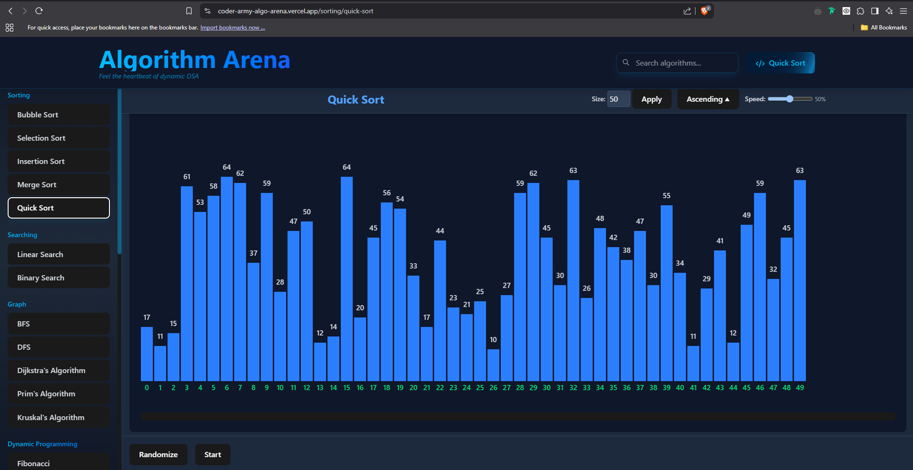

<div align="center">
  

  <h2>Interactive Algorithm Racing Platform Built with React</h2>

[]()
[](/LICENSE)
[]()
[]()

</div>

## 📋 Quick Links

- [Live Demo](https://coder-army-algo-arena.vercel.app/)
- [Features](#features)
- [How to Use](#how-to-use)
- [Technical Details](#technical-details)
- [Future Enhancements](#future-enhancements)
- [Contributing](#contributing)
- [License](#license)

## 🚀 Introduction

AlgoArena is a dynamic, interactive platform for comparing algorithm performance in real-time. Race different algorithms head-to-head to visualize their efficiency and learn about computational complexity in an engaging way.

## ✨ Key Features

### 🏁 Algorithm Racing

- Real-time algorithm comparison
- Visual race progress bars
- Step counting and performance metrics
- Customizable input sizes

### 📊 Performance Analytics

- Efficiency ratio calculation
- Steps taken measurements
- Time elapsed tracking
- Relative performance percentages

### 🎮 Interactive Learning

- Algorithm visualization
- Race results leaderboard
- Medal system for top performers
- Performance interpretation guide

### 📱 Modern UI/UX

- Responsive design for all devices
- Clean, intuitive interface
- Animated transitions
- Dark mode optimized

### 🧩 Customizable Experience

- Multiple algorithm selection
- Adjustable race parameters
- Real-time progress tracking
- Detailed results breakdown

## 🛠️ Installation

```bash
# Clone repository
git clone https://github.com/yourusername/CoderArmy-AlgoArena.git

# Navigate to project directory
cd CoderArmy-AlgoArena

# Install dependencies
npm install

# Start development server
npm run dev
```

## 💡 Usage

### Starting a Race

1. Select algorithms to compete
2. Configure input parameters
3. Click "Start Race" button
4. Watch algorithms compete in real-time
5. View detailed results upon completion

### Analyzing Results

- Compare efficiency percentages
- Review step count for each algorithm
- See time elapsed for all competitors
- Identify the most efficient solution
- Learn about algorithm performance characteristics

### Learning From Races

- Read the "Interpreting Results" section
- Compare algorithms with similar functions
- Observe how input size affects performance
- Experiment with edge cases
- Challenge yourself to optimize algorithms

## 🔧 Tech Stack

- React 18
- Vite
- Tailwind CSS
- Motion library for animations
- React Router

## 🔮 Future Enhancements

### Algorithm Features

- Additional algorithm types
- Custom algorithm submission
- Algorithm explanation tooltips
- Code viewing for each algorithm
- Step-by-step execution mode

### User Experience

- User accounts
- Save favorite algorithms
- Create custom races
- Share race results
- Community leaderboards

### Technical Improvements

- Improved visualization options
- More detailed performance metrics
- Algorithm complexity estimator
- Educational resources integration
- API for algorithm submission

## 🤝 Contributing

1. Fork the repo
2. Create feature branch: `git checkout -b feature/amazing`
3. Commit: `git commit -m "Add amazing feature"`
4. Push: `git push origin feature/amazing`
5. Open pull request

## 📷 Project Screenshots

<div align="center">
  <div style="display: flex; flex-wrap: wrap; gap: 10px; justify-content: center;">
    
    
    
    
  </div>
</div>

## 📄 License

MIT © [License](./LICENSE)

---

<div align="center">
  Made with ❤️ by <a href="https://github.com/DEVENWAGH">DEVEN WAGH</a>
</div>
